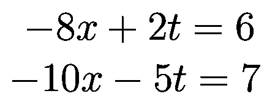

##Generation of Synthetic Equations and Their Textual Descriptions

The goal is to generate seven categories of equations: linear equation, a pair of linear equations, inequalities, limit, differentiation, integral and finite integral and their textual descriptions.

#Generated Synthetic Pair of Equations and Its Textual Description

minus eight times x plus two times t equal to six and minus ten times x minus five times t equal to seven

##Usage
#1. Clone the repositories
 $ git clone https://github.com/pdollar/coco.git

#2. Generate LaTex corresponds to each type of equations and its textual descriptions
$ pip install -r requirement.txt
$ cd 0_code_generate_latex_equation
$ python 1_pair_of_equation.py 
(Generate LaTex for pair of equations and their textual descriptions; saved in 1_generate_latex_files/1_pair_of_equation_latex and 20_generate_textual_description/

