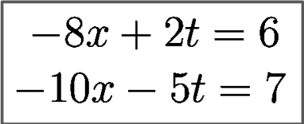

# Generation of Synthetic Equations and Their Textual Descriptions

The goal is to generate seven categories of equations: linear equation, a pair of linear equations, inequalities, limit, differentiation, integral and finite integral and their textual descriptions.

## Generated Synthetic Pair of Equations and Its Textual Description

minus eight times x plus two times t equal to six and minus ten times x minus five times t equal to seven

## Usage
## 1. Clone the repositories
 $ git clone https://github.com/ajoymondal/Equation-Description-PyTorch.git

## 2. Generate LaTex corresponds to each type of equations and its textual descriptions
$ pip install -r requirement.txt
$ cd 0_code_generate_latex_equation
$ python 1_pair_of_equation.py 
(Generate LaTex for pair of equations and their textual descriptions; saved in 1_generate_latex_files/1_pair_of_equation_latex and 20_generate_textual_description/pair_of_equation, respectively)

## Similarly for other equations 
$ python 2_linear_equation.py or 3_inequality.py or 4_limit.py or 5_differentiation.py or 6_integral.py or 7_finite_integral.py

## 3. Generate pdfs corresponds to Latex for each type of equations

$ cd 2_generate_latex_to_pdf/1_pair_of_equation_pdf
$ python latex_to_pdf_pair_of_equation.py

## Similarly for other equations
$ cd 2_generate_latex_to_pdf/2_linear_equation_pdf or 3_inequality_pdf or 4_limit_pdf or 5_differentiation_pdf or 6_integral_pdf or 7_finite_integral_pdf

$python latex_to_pdf_linear_equation.py or latex_to_pdf_inequality.py or latex_to_pdf_limit.py or latex_to_pdf_differentiation.py or latex_to_pdf_integral.py or latex_to_pdf_finite_integral.py

## 4. Generate images corresponds to pdfs for each type of equations
$ cd 3_generate_pdf_to_image
$ python pair_of_equation_pdf2png.py

## Similarly for other equations
$ python linear_equation_pdf2png.py or inequality_pdf2png.py or limit_pdf2png.py or differentiation_pdf2png.py or integral_pdf2png.py or finite_integral_pdf2png.py

## 5. Crop equation from images of each type of equations
$ cd 4_generate_crop_image
$ python pair_of_equation_crop_image.py

## Similarly for other equations
$ python linear_equation_crop_image.py or inequality_crop_image.py or limit_crop_image.py or differentiation_crop_image.py or integral_crop_image.py or finite_integral_crop_image.py

Finally cropped equations and their descriptions are saved in the following folder structure

$cd 4_generate_crop_image/1_pair_of_equation_crop_image or 2_linear_equation_crop_image or 3_inequality_crop_image or 4_limit_crop_image or 5_differentiation_crop_image or 6_integral_crop_image or 7_finite_integral_crop_image

and 
$ cd 20_generate_textual_description/pair_of_equation or linear_equation or inequality or limit or differentiation or integral or finite_integral 

# Textual Description for Mathematical Equations
## Overview of Mathematical Expression Description Network 

## Create vocabulary 
MED$ python3 build_vocab.py
## Resise Images
MED$ python3 resize.py
## Training 
MED$ python3 train.py
## Evaluate
MED$ python3 sample.py

# Results

integral of second root of all theta minus a with respect to theta

integral of sec z with respect to z from lower limit minus pie by two to upper limit minus pie by four

differentiation of five all over second root of all tweenty five minus t square with respect to t

right hand limit of sin x over x as x approaches to zero

left hand limit of x power of a all minus one all over x as x approaches to zero

limit of second root of all y plus five all over y plus five as y approaches to five

ten times y less than or equal to three times y plus ten

y minus z equal to minus one and minus four times z minus five times t equal to two

two equal to minus t plus five
